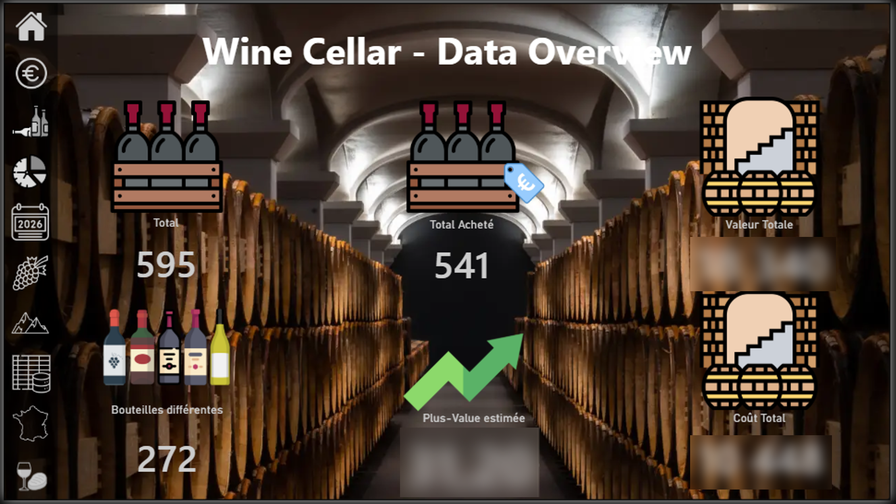
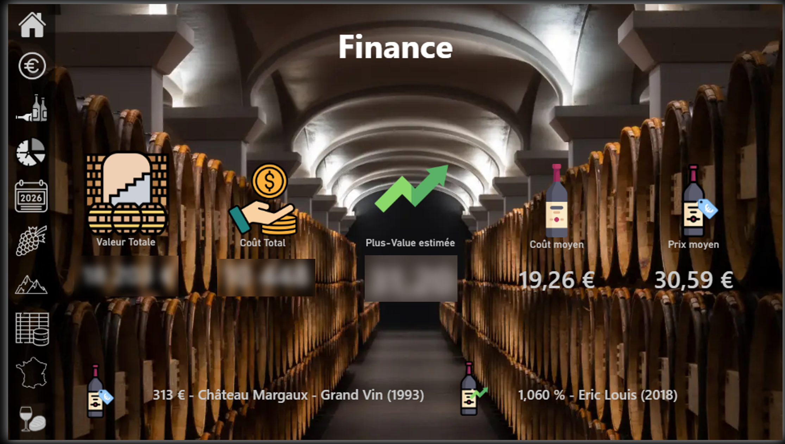
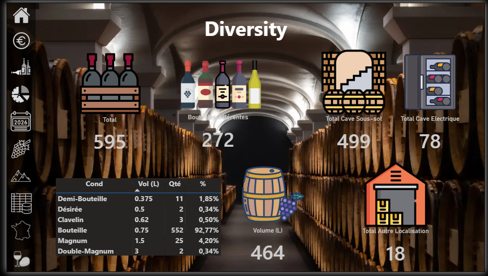
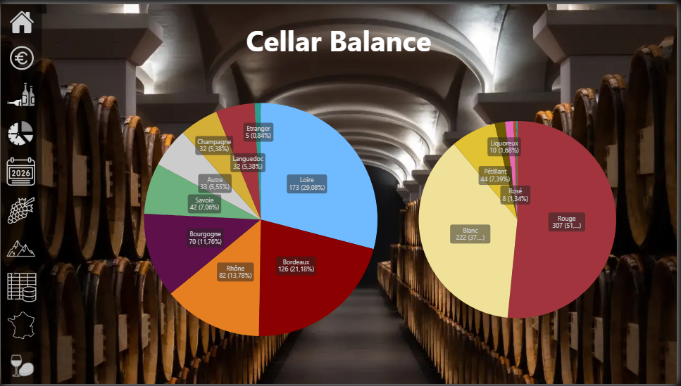
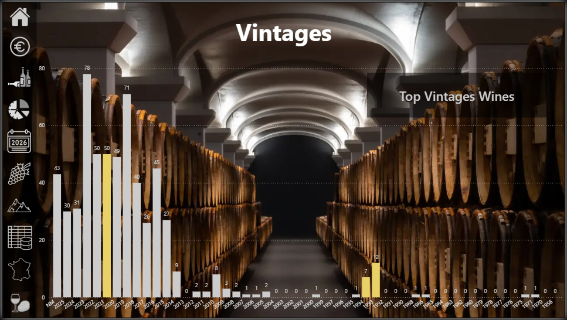
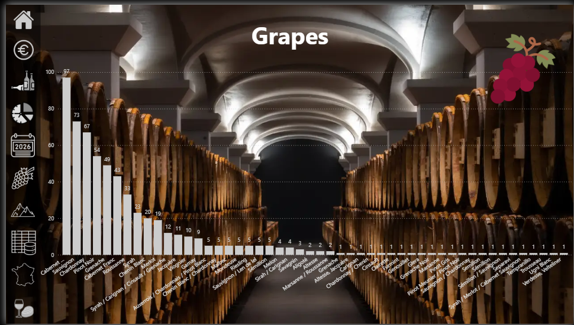
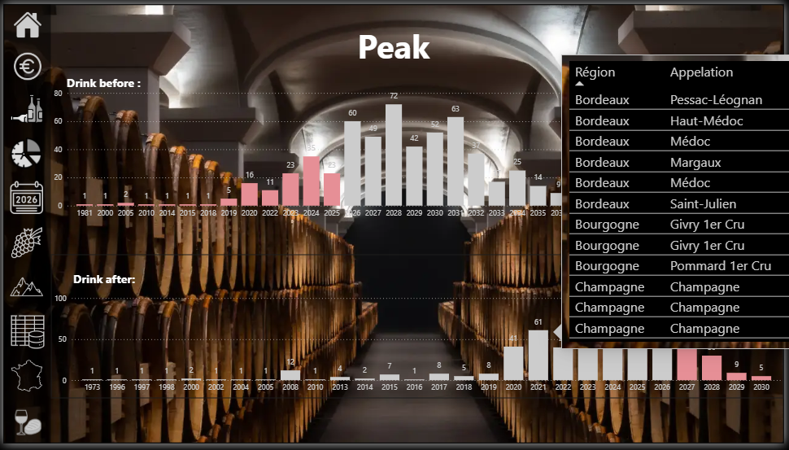
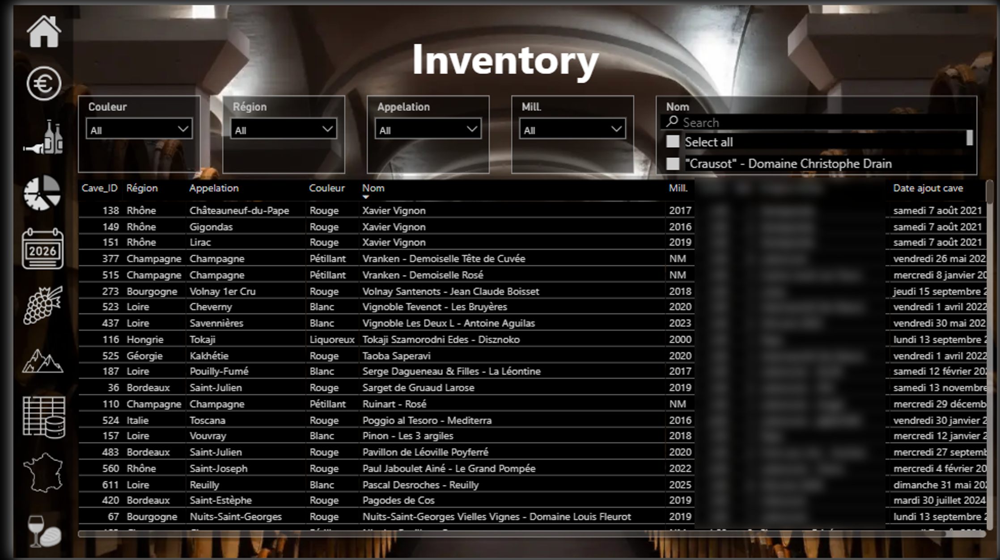
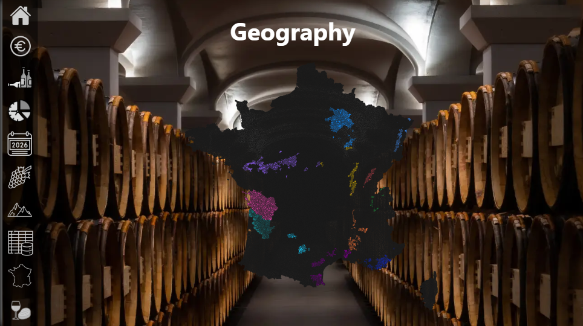
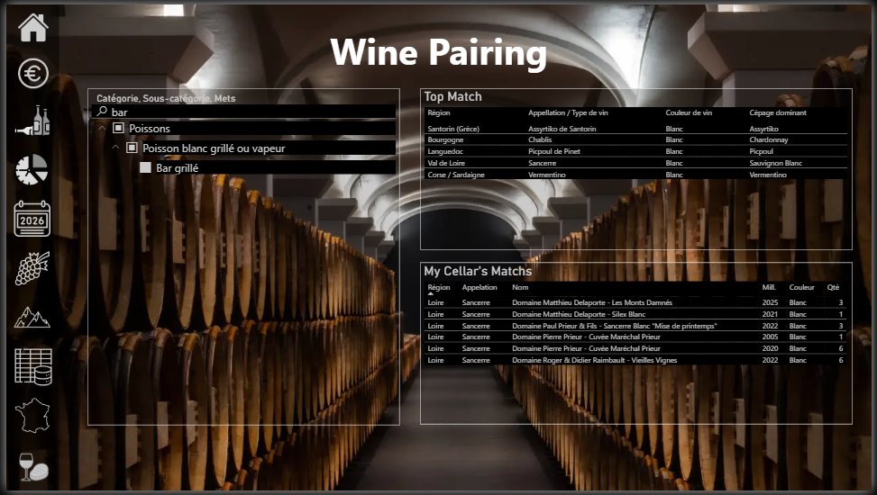

# Wine Cellar Monitoring

A Data Analytics project using Python and Power BI to develop an interactive dashboard for monitoring and analysing a personal wine cellar.
The project combines wine inventory data, vintage ratings, appellation information and geographical data to create a dynamic decision-support tool.
________________

## Project Overview

Managing a wine cellar involves more than tracking the number of bottles available. Understanding stock distribution, wine characteristics, vintage quality, geographical origins and consumption opportunities can support better purchasing, inventory management and wine selection.

This project aims to transform a personal wine inventory into an interactive analytical solution using Python and Power BI.

The objective is to answer several business-oriented questions:

- What is the current composition of my wine cellar?
- How are bottles distributed across wine regions, appellations and colours?
- Which vintages and wines have the highest ratings?
- How can I monitor stock levels and identify key characteristics of my collection?
- Which food and wine pairings could help support wine selection?

The project follows a data analytics workflow, from data preparation and transformation to data modelling, visualisation and interactive analysis.

It also reflects my professional background in industrial engineering and logistics. Inventory management, data quality, operational monitoring and decision support are central themes in both industrial operations and wine cellar management.

The project therefore combines my newly acquired Data Analytics skills with my personal interest in wine.

________________

## Objectives

- Build a dynamic dashboard to monitor wine cellar inventory.
- Analyse bottle distribution by region, appellation and color.
- Integrate vintage ratings into the wine inventory.
- Develop geographical visualisations of the wine collection.
- Identify highly rated vintages and wines.
- Create a structured data model in Power BI.
- Explore food and wine pairings based on appellation and wine color.

________________

## Dashboard Preview

To be completed

________________

## Key Features

### 🍷 Wine Inventory Monitoring

- Total number of bottles.
- Inventory distribution by wine colour.
- Distribution by wine region and appellation.
- Analysis of wine categories and stock composition.
- Monitoring of inventory characteristics.

### 📊 Vintage Analysis

- Integration of vintage ratings by wine region.
- Identification of highly rated vintages.
- Analysis of wine distribution according to vintage quality.
- Filtering of wines based on vintage ratings.

### 🗺️ Geographical Analysis

- Geographical visualisation of the wine collection.
- Custom maps for French wine appellations.
- World map showing wine distribution by country.
- Integration of geographical reference data.
- Development of custom geographical keys to support Power BI Shape Maps.

### 🍽️ Food and Wine Pairings

- Development of a structured food and wine pairing database.
- Association between dishes and wine appellations.
- Integration of wine colour into pairing analysis.
- Exploration of food recommendations based on wine characteristics.

________________

## Tools

Python
Power BI
GeoJSON/TopoJSON
Jupyter Notebook
________________

## Process

Business Understanding

↓

Data Collection

↓

Data Preparation

↓

Data Cleaning

↓

Data Modelling

↓

DAX Measures

↓

Power BI Dashboard

↓

Business Insights

________________

## Structure

📁 screenshots

Dashboard Screenshots

📁 data

Overall datasets

📁 notebooks

Python notebooks used for data preparation and transformation.

📄 README.md

________________

## Data Sources

The project combines several data sources to build a structured wine cellar monitoring solution.

🍷 Wine Inventory

Personal wine cellar inventory maintained in Excel.

The dataset contains information about wines, vintages, quantities, appellations, regions, colours and other inventory characteristics.

🔖 Vintage Ratings

Reference data containing vintage ratings by wine region.

These ratings are integrated into the wine inventory to support vintage analysis.

🗺️ Geographical Data

Geographical reference data used to develop custom maps of French wine appellations and international wine origins.

The project explores the use of geographical boundaries, commune-level data and appellation correspondence tables.

🍽️ Food and Wine Pairings

External and manually curated reference data used to explore relationships between dishes, wine appellations and colours.

The pairing database is designed to support analytical exploration rather than provide absolute recommendations.

________________

## Data Privacy and Anonymisation

This project is based on a personal wine cellar inventory.

To protect sensitive information, the public version of the project may exclude or anonymise certain data fields, including:

- Purchase prices.
- Total inventory value.
- Personally identifiable information.
- Sensitive inventory details.
- Other information that could reveal personal purchasing habits.

The public dataset and dashboard screenshots will be adapted to demonstrate the analytical approach while limiting the exposure of private information.

The objective is to provide a reproducible and professional portfolio project without unnecessarily publishing personal data.

________________

## Conclusion

This project demonstrates the complete workflow of a Data Analyst, from data preparation and integration to data modelling, visualisation and business-oriented analysis.

It illustrates how a personal dataset can be transformed into an interactive Business Intelligence solution using Python and Power BI.

The project combines inventory monitoring, reference data integration, geographical analysis and food and wine pairing exploration.

It also demonstrates the importance of data quality, automated transformations, appropriate data modelling and privacy considerations when developing an analytical solution.

The project reflects my transition into Data Analytics and my interest in applying technical and analytical skills to practical business problems.
